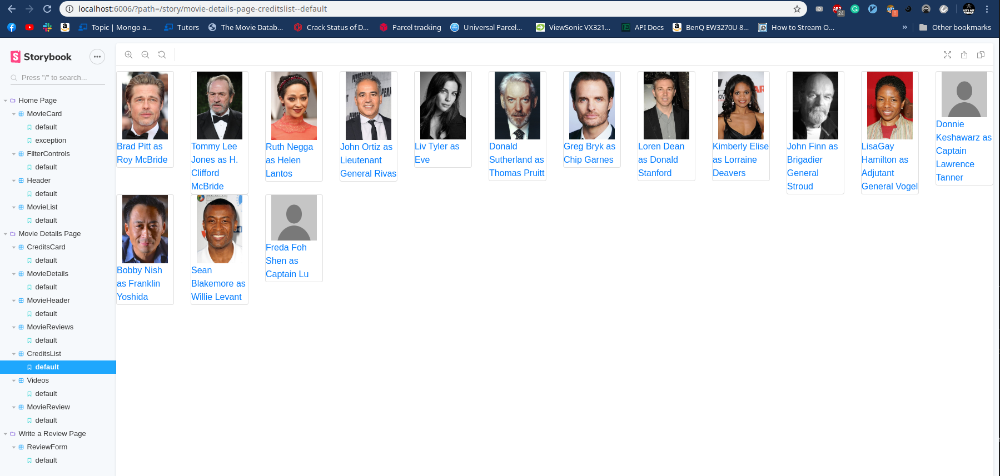
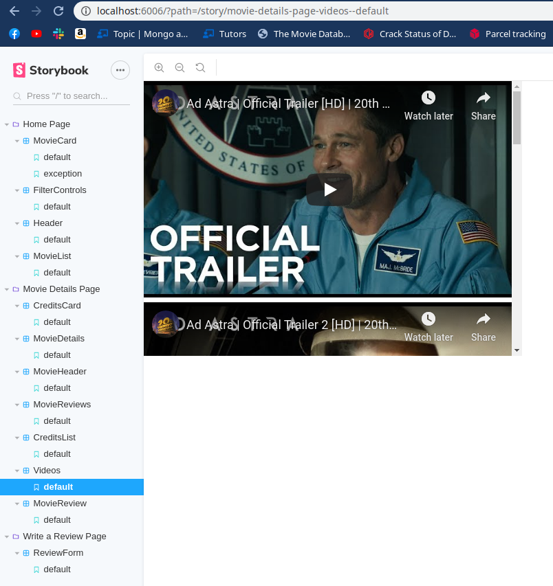
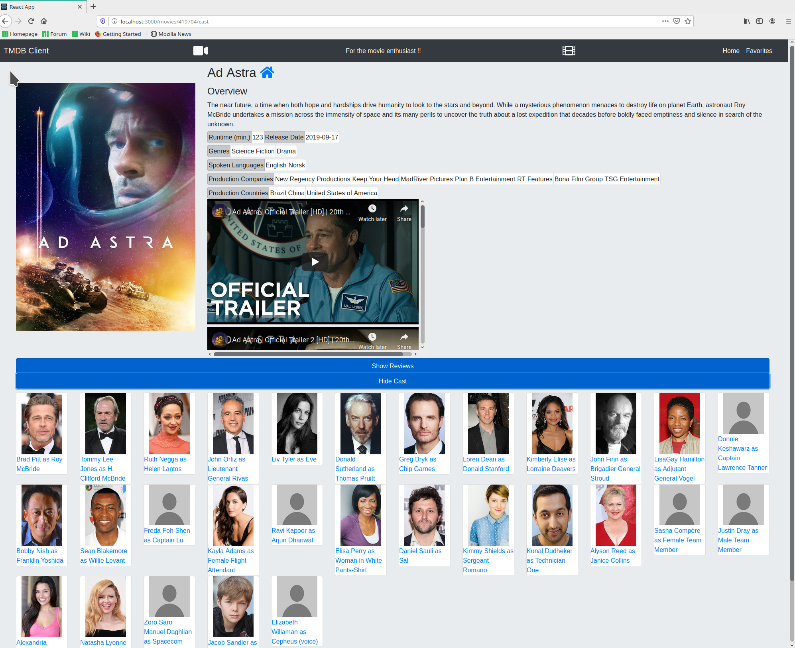

# Assignment 1 - ReactJS app.

Name: Bartosz Osowski

## Overview.
#### Additional objectives:
* Addition of embedded youtube videos related to the movies which can be seen on the movie details page.
* Addition of the movie cast for each movie. 

## Setup requirements.
#### Packages
* nodejs (version used = 13.12.0)
#### Setup
* execute `npm install && npm start`

## Data Model Design.

#### Additional TMDB endpoints used and sample responses, in JSON:
|endpoint|Sample Response|
| -- | --
|`/api/movies/419704/credits`|`{"id": 419704, "cast": [{"cast_id": 271,"character": "Roy McBride","credit_id": "5e93b22dd55e4d001a19f94a","gender": 2, "id": 287, "name": "Brad Pitt", "order": 1,"profile_path": "/tJiSUYst4ddIaz1zge2LqCtu9tw.jpg", ...}]}`
|`/api/movies/419704/videos`|`{"id":419704,"results":[{"id":"5cf81bfb92514153b7b9e733","iso_639_1":"en","iso_3166_1":"US","key":"P6AaSMfXHbA","name":"Official Trailer #1","site":"YouTube","size":1080,"type":"Trailer"}, ...]}`

## App Design.

### Component catalogue.

### Design patterns.

+ The container pattern was used for the cast. A "creditsCard" was embedded in a "credits" component.
+ Custom hooks have been used pretty much for every component that required an API call.

## UI Design.

#### Details page

>Shows the movie's cast and related youtube videos.

## Routing.

#### Private
+ `/movies`
+ `/movies/$id`
+ `/movies/favorites`
+ `/movies/$id/reviews`
+ `/movies/$id/cast`
+ `/reviews/form`
+ `/reviews/$id`

#### Non-private
+ `/login`
+ `/register`

## Independent learning.

+ Further research on hooks and nested components.